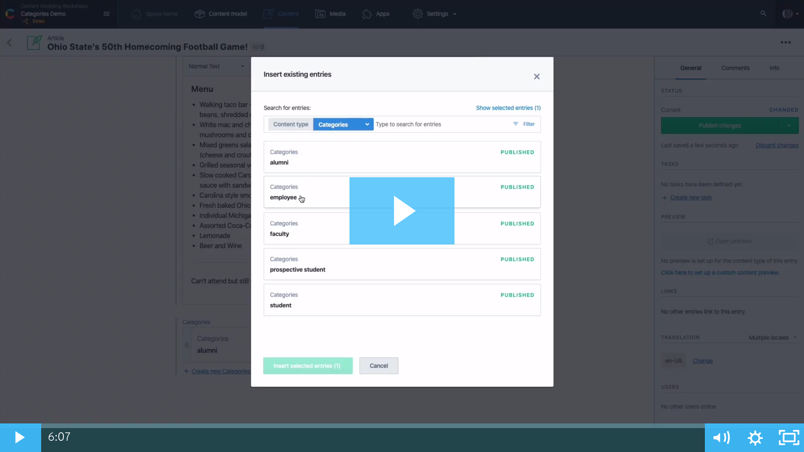

# Contentful Categories Demo
Categorizing your content is important and easy to do in Contentful. This repo contains a simple content model and sample content showing how you can create a categories content type and use it within any exisiting of new content type.

You can watch this [video](https://contentful.wistia.com/medias/59k1p163ze) to see a quick demo of the tutorial.

